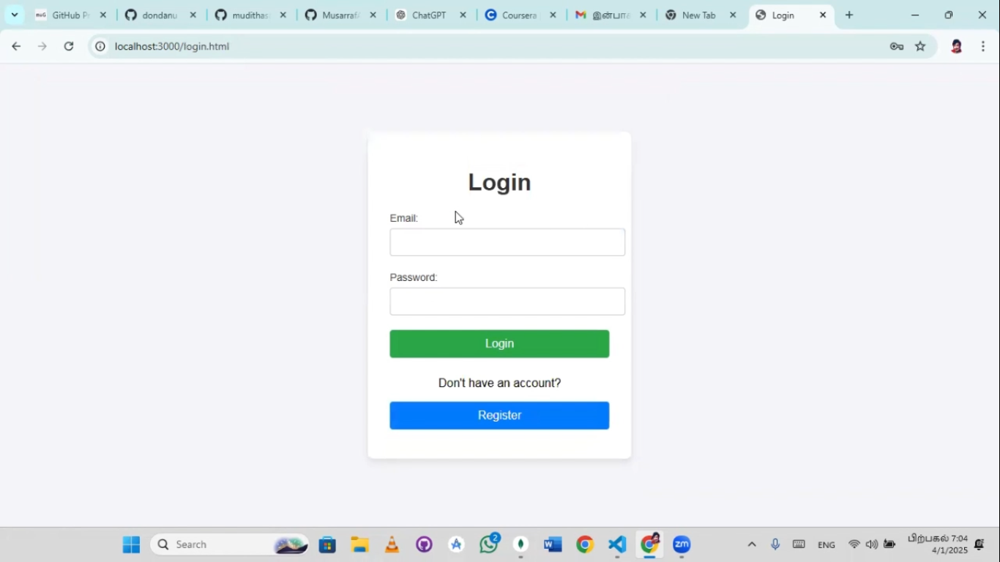
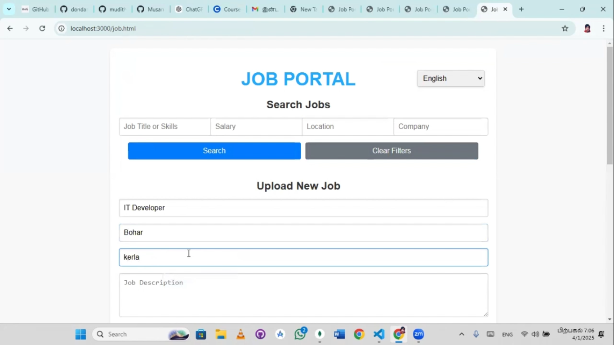
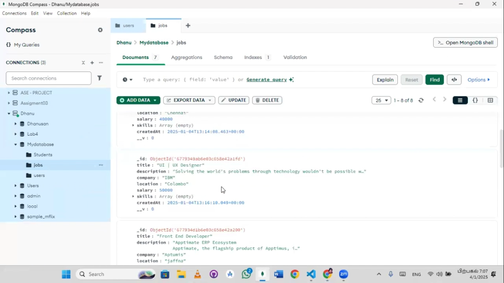
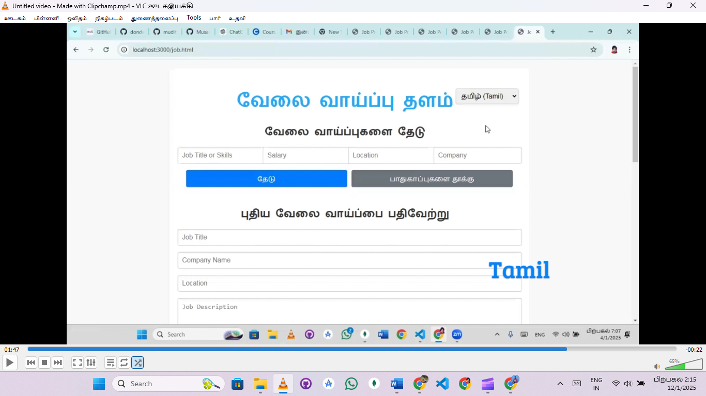

# 🌟 Job Portal 🌟  

A powerful and user-friendly job portal built with **MongoDB**, **Node.js**, and **HTML**, designed to make job searching seamless and efficient.  

---

## 🚀 Features  

- **User Authentication**: Secure login, registration, and logout functionality.  
- **Job Management**: Add, view, and manage job details effortlessly.  
- **Advanced Filtering**: Filter jobs by **name**, **salary**, or **location**.  
- **Multilingual Support**: Switch between **Tamil**, **English**, and **Sinhala** for a better user experience.  

---

## 💻 Tech Stack  

- **Backend**: Node.js  
- **Database**: MongoDB  
- **Frontend**: HTML  

---

## 📸 Screenshots  

Here’s a glimpse of the platform in action:  

<div style="display: flex; flex-wrap: wrap; gap: 20px; margin-top: 10px;">  
    
    
    
    
</div>  

---

## 📂 Installation  

Follow these steps to set up the project locally:  

1. Clone the repository:  
   ```bash  
   git clone https://github.com/your-repo-link
   
2. Navigate to the project folder:
   ```bash
   cd job-portal

3. Install dependencies:
   ```bash
   npm install  

4. Start the application:
   ```bash
   npm start  

5. Open your browser and navigate to http://localhost:3000

 
